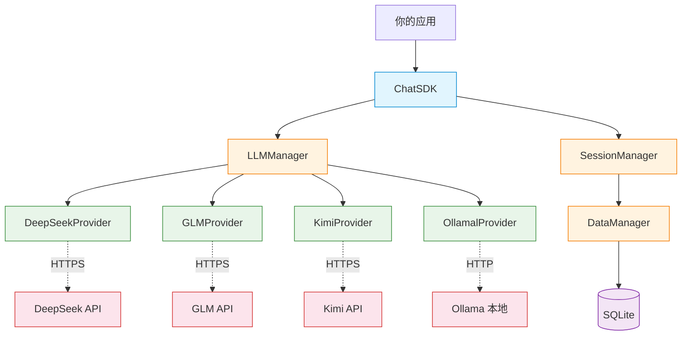
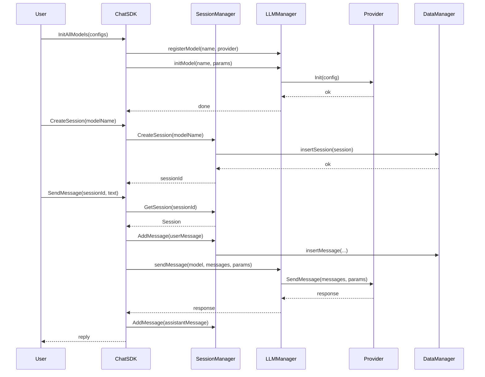
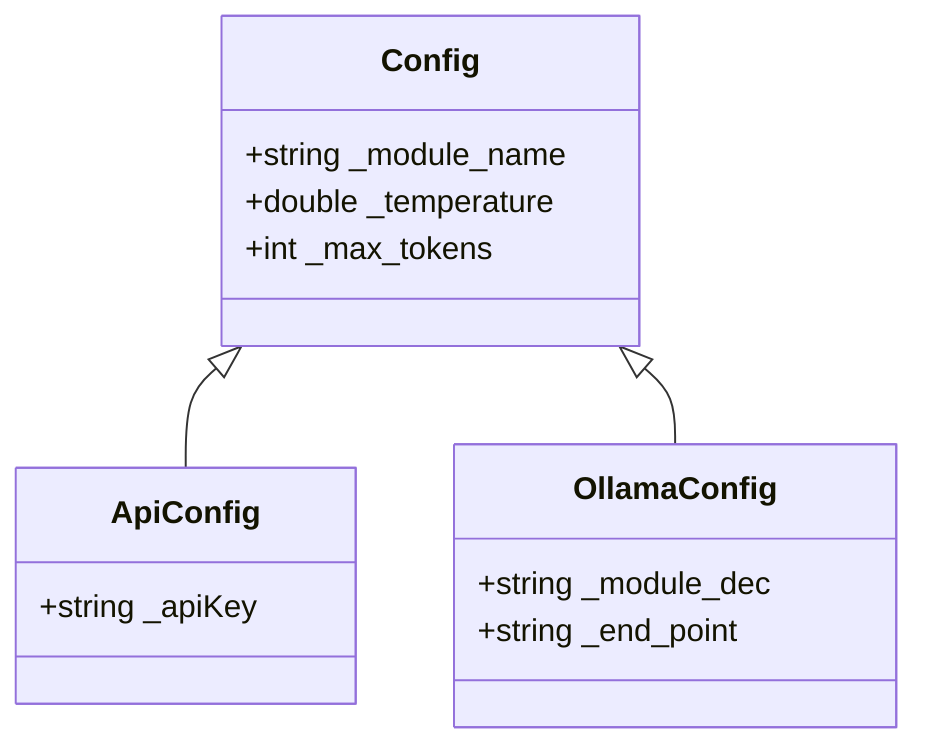
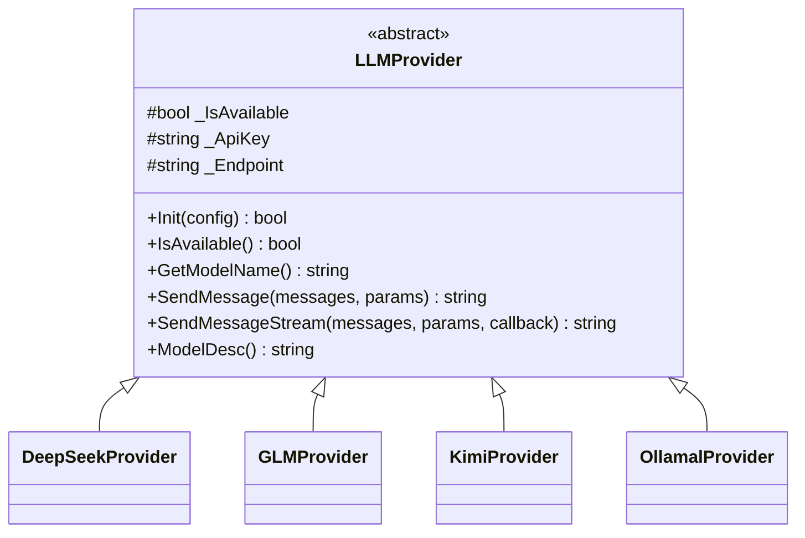
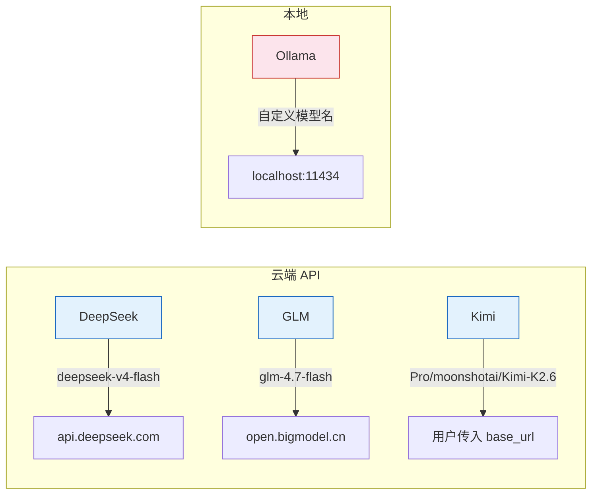
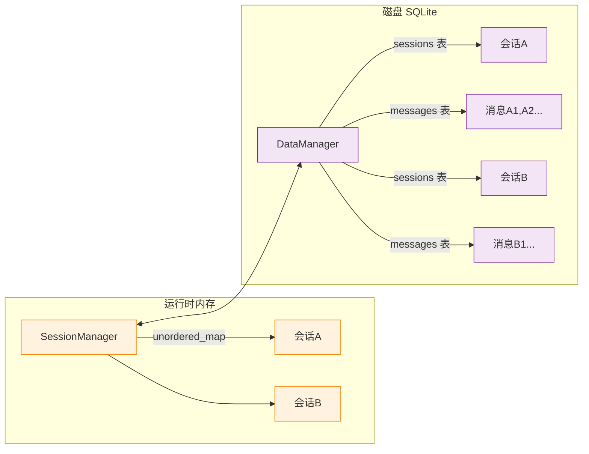

# AI_Chat_SDK

一个 C++17 多模型 LLM 对话 SDK，支持 **DeepSeek、GLM、Kimi** 云端 API 和 **Ollama** 本地模型，统一接口管理会话与消息持久化。

---

## 整体架构



| 层次 | 职责 |
|------|------|
| **ChatSDK** | 外观模式，统一入口，管理初始化、会话、消息发送 |
| **LLMManager** | 注册/初始化模型 Provider，根据模型名路由消息 |
| **SessionManager** | 创建/删除/查询会话，管理消息列表，线程安全 |
| **DataManager** | SQLite 持久化，保存会话和消息到本地文件 |
| **Provider** | 各个模型的 API 调用实现 |

---

## 消息生命周期



---

## 数据结构

### 消息 (Message)

```cpp
struct Message {
    std::string _message_id;       // 消息 ID（自动生成）
    std::string _role;             // "user" 或 "assistant"
    std::string _content;          // 消息内容
    std::time_t _timestamp;        // 时间戳
};
```

### 会话 (Session)

```cpp
struct Session {
    std::string _session_id;               // 会话 ID（自动生成）
    std::string _model_name;               // 关联的模型名称
    std::vector<Message> _messages;        // 消息列表
    std::time_t _createAt;                 // 创建时间
    std::time_t _updateAt;                 // 最后更新时间
};
```

### 配置继承体系



### Provider 接口体系



---

## 快速上手

### 1. 构建

依赖：C++17、CMake、spdlog、fmt、SQLite3、jsoncpp、cpp-httplib、GTest

```bash
cd test/build
cmake ..
make LLMTest
```

### 2. 初始化 SDK

```cpp
#include "ChatSDK.h"

// 初始化日志
bite::Logger::InitLogger("MyApp", "stdout", spdlog::level::info);

// 创建 SDK，指定 SQLite 数据库文件名
auto sdk = std::make_shared<AI_Chat_SDK::ChatSDK>("my_chat.db");
```

### 3. 配置并初始化模型

```cpp
using namespace AI_Chat_SDK;

// --- DeepSeek ---
auto deepseek = std::make_shared<ApiConfig>();
deepseek->_module_name = "deepseek-v4-flash";
deepseek->_apiKey = std::getenv("DEEPSEEK_API_KEY");
deepseek->_temperature = 0.7;
deepseek->_max_tokens = 2048;

// --- GLM ---
auto glm = std::make_shared<ApiConfig>();
glm->_module_name = "glm-4.7-flash";
glm->_apiKey = std::getenv("GLM_API_KEY");

// --- Kimi ---
auto kimi = std::make_shared<ApiConfig>();
kimi->_module_name = "Pro/moonshotai/Kimi-K2.6";
kimi->_apiKey = std::getenv("KIMI_API_KEY");

// --- Ollama 本地模型 ---
auto ollama = std::make_shared<OllamaConfig>();
ollama->_module_name = "llama3.2";
ollama->_end_point = "http://localhost:11434";

// 统一初始化
std::vector<std::shared_ptr<Config>> configs = { deepseek, glm, kimi, ollama };
sdk->InitAllModels(configs);
```

### 4. 非流式对话

```cpp
// 创建会话
std::string sid = sdk->CreateSession("deepseek-v4-flash");

// 发送消息，等待完整回复
std::string reply = sdk->SendMessage(sid, "你好，请介绍一下自己");
std::cout << reply << std::endl;

// 继续对话（自动携带上下文）
reply = sdk->SendMessage(sid, "刚才问了什么问题还记得吗？");
std::cout << reply << std::endl;
```

### 5. 流式对话

```cpp
std::string sid = sdk->CreateSession("glm-4.7-flash");

std::string full = sdk->sendMessageStream(
    sid,
    "用流式介绍架构",
    [&](const std::string& chunk, bool done) {
        std::cout << chunk << std::flush;
        if (done) std::cout << "\n[完成]" << std::endl;
    }
);
```

---

## API 参考

### ChatSDK

| 方法 | 返回值 | 说明 |
|------|--------|------|
| `ChatSDK(dbName)` | — | 构造，`dbName` 默认 `"chatDB.db"` |
| `InitAllModels(configs)` | `bool` | 注册并初始化所有模型 |
| `CreateSession(modelName)` | `string` | 创建会话，返回会话 ID |
| `GetSessionList()` | `vector<string>` | 获取会话 ID 列表（按更新时间降序） |
| `GetSession(sessionId)` | `shared_ptr<Session>` | 获取会话及消息列表 |
| `DeleteSession(sessionId)` | `bool` | 删除会话和关联消息 |
| `GetAvailableModels()` | `vector<ModuleInfo>` | 获取已初始化的模型列表 |
| `SendMessage(sessionId, text)` | `string` | 非流式发送消息 |
| `sendMessageStream(sessionId, text, cb)` | `string` | 流式发送，逐块回调 |

### 流式回调签名

```cpp
std::function<void(const std::string& chunk, bool isComplete)>
```

- `chunk` — 当前收到的文本片段
- `isComplete` — `true` 表示传输结束

---

## 支持的模型



| 模型名 | 配置类型 | 默认 Endpoint | 需要 API Key |
|--------|---------|--------------|:----------:|
| `deepseek-v4-flash` | `ApiConfig` | `https://api.deepseek.com` | ✅ |
| `glm-4.7-flash` | `ApiConfig` | `https://open.bigmodel.cn` | ✅ |
| `Pro/moonshotai/Kimi-K2.6` | `ApiConfig` | 必须手动传入 | ✅ |
| 自定义（Ollama） | `OllamaConfig` | 必须手动传入 | ❌ |

---

## 会话持久化



- 创建 / 删除会话 → 写 SQLite
- 添加消息 → 写 SQLite
- 删除会话 → 级联删除关联消息
- 启动时从 SQLite 加载所有会话到内存

---

## 项目文件结构

```
SDK/
├── include/
│   ├── ChatSDK.h              # 主入口
│   ├── LLMProvider.h          # Provider 抽象基类
│   ├── LLMManager.h           # 模型管理器
│   ├── SessionManager.h       # 会话管理器
│   ├── DataManager.h          # SQLite 持久化
│   ├── common.h               # 数据结构 & 配置
│   ├── DeepSeekProvider.h
│   ├── GLMProvider.h
│   ├── KimiProvider.h
│   ├── OllamalProvider.h
│   └── util/
│       └── myLog.h            # 日志宏
├── src/
│   ├── ChatSDK.cpp
│   ├── DeepSeekProvider.cpp
│   ├── GLMProvider.cpp
│   ├── KimiProvider.cpp
│   ├── OllamalProvider.cpp
│   ├── LLMManager.cpp
│   ├── SessionManager.cpp
│   ├── DataManager.cpp
│   └── util/myLog.cpp
test/
├── CMakeLists.txt
├── TestLLM.cpp
└── build/
```
