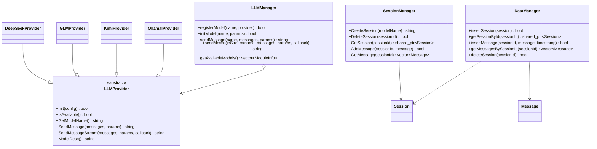

# AI_SDK

一个基于 C++17 的多模型 AI 聊天 SDK，支持多种大语言模型（LLM）的统一接入、会话管理和本地数据持久化。

## ✨ 特性

- **多模型统一接入** — 通过抽象基类 `LLMProvider`，提供统一的接口以接入不同的大语言模型
- **支持多种模型提供商**
  - [DeepSeek](https://platform.deepseek.com/) — 擅长推理与代码生成
  - [智谱 GLM](https://open.bigmodel.cn/) — GLM-4.7-Flash
  - [Kimi / Moonshot](https://platform.moonshot.cn/) — 长文本处理
  - [Ollama](https://ollama.com/) — 本地部署模型
- **流式/非流式响应** — 同时支持 SSE 流式回调与一次性返回
- **会话管理** — 创建、删除、查询会话，管理多轮对话消息
- **数据持久化** — 基于 SQLite3，会话与消息记录自动存储
- **日志系统** — 基于 spdlog 的异步日志，支持输出到控制台或文件
- **线程安全** — 核心组件均使用互斥锁保护，支持多线程并发访问

## 🏗️ 项目结构

```
AI_SDK/
├── include/               # 头文件
│   ├── common.h           # 核心数据结构（Message, Session, Config, ModuleInfo 等）
│   ├── LLMProvider.h      # LLM 提供者抽象基类
│   ├── LLMManager.h       # 模型管理器（注册、初始化、调用）
│   ├── SessionManager.h   # 会话管理器
│   ├── DataManager.h      # 数据持久化（SQLite）
│   ├── DeepSeekProvider.h # DeepSeek 实现
│   ├── GLMProvider.h      # 智谱 GLM 实现
│   ├── KimiProvider.h     # Kimi 实现
│   ├── OllamalProvider.h  # Ollama 本地模型实现
│   └── util/
│       └── myLog.h        # 日志工具（spdlog）
├── src/                   # 源文件
│   ├── DeepSeekProvider.cpp
│   ├── GLMProvider.cpp
│   ├── KimiProvider.cpp
│   ├── OllamalProvider.cpp
│   ├── LLMManager.cpp
│   ├── SessionManager.cpp
│   ├── DataManager.cpp
│   └── util/
│       └── myLog.cpp
└── test/                  # 单元测试（GTest）
    ├── CMakeLists.txt
    └── TestLLM.cpp
```

## 🚀 快速开始

### 依赖

| 依赖 | 说明 |
|------|------|
| C++17 编译器 | GCC 8+ / Clang 10+ / MSVC 2019+ |
| [cpp-httplib](https://github.com/yhirose/cpp-httplib) | HTTP/HTTPS 客户端 |
| [jsoncpp](https://github.com/open-source-parsers/jsoncpp) | JSON 序列化/反序列化 |
| [spdlog](https://github.com/gabime/spdlog) | 异步日志库 |
| [fmt](https://github.com/fmtlib/fmt) | 字符串格式化（spdlog 依赖） |
| SQLite3 | 数据持久化 |
| OpenSSL | HTTPS 支持 |
| [GTest](https://github.com/google/googletest) | 单元测试（仅 test 需要） |

### 构建（测试）

```bash
cd test
mkdir -p build && cd build
cmake ..
make
./LLMTest
```

## 📖 使用示例

### 1. 注册并调用模型

```cpp
#include "LLMManager.h"
#include "DeepSeekProvider.h"
#include "util/myLog.h"

using namespace AI_Chat_SDK;

// 1. 初始化日志
bite::Logger::InitLogger("MyApp", "stdout", spdlog::level::info);

// 2. 创建模型管理器
LLMManager manager;

// 3. 注册 DeepSeek
manager.registerModel("deepseek", std::make_unique<DeepSeekProvider>());

// 4. 初始化（传入 API Key）
manager.initModel("deepseek", {
    {"api_key", getenv("DEEPSEEK_API_KEY")},
    {"base_url", "https://api.deepseek.com"}
});

// 5. 发送消息（非流式）
std::vector<Message> messages;
messages.push_back({"user", "你好，请介绍一下你自己"});

std::string reply = manager.sendMessage("deepseek", messages, {
    {"temperature", "0.7"},
    {"max_output_tokens", "4096"}
});
```

### 2. 流式调用

```cpp
manager.sendMessageStream("deepseek", messages,
    {
        {"temperature", "0.7"},
        {"max_output_tokens", "4096"}
    },
    [](const std::string& chunk, bool isComplete) {
        if (isComplete) {
            INFO("[DONE]");
        } else {
            std::cout << chunk << std::flush;
        }
    }
);
```

### 3. 会话管理

```cpp
SessionManager sessionMgr;

// 创建会话
std::string sessionId = sessionMgr.CreateSession("deepseek");

// 添加消息
sessionMgr.AddMessage(sessionId, {"user", "你好"});
sessionMgr.AddMessage(sessionId, {"assistant", "你好！有什么可以帮助你的？"});

// 获取会话消息
auto msgs = sessionMgr.GetMessage(sessionId);

// 获取会话列表
auto sessions = sessionMgr.GetSessionList();
```

### 4. 数据持久化

```cpp
DataManager dataMgr("chat_history.db");

// 插入会话
auto session = std::make_shared<Session>("deepseek");
session->_session_id = "session_001";
dataMgr.insertSession(session);

// 插入消息
dataMgr.insertMessage("session_001",
    {"user", "hello"}, std::time(nullptr));
```

## 🧩 扩展自定义模型

继承 `LLMProvider` 并实现以下纯虚方法即可接入新的模型：

```cpp
class MyProvider : public LLMProvider {
    bool Init(const std::map<std::string, std::string>& config) override;
    bool IsAvailable() const override;
    std::string GetModelName() const override;
    std::string SendMessage(std::vector<Message> messages,
                            std::map<std::string, std::string> requestParam) override;
    std::string SendMessageStream(std::vector<Message> messages,
                                  std::map<std::string, std::string> requestParam,
                                  std::function<void(std::string, bool)> callback) override;
    std::string ModelDesc() const override;
};
```

## 📋 核心数据结构

| 结构体 | 说明 |
|--------|------|
| `Message` | 单条消息（id、角色、内容、时间戳） |
| `Session` | 会话（id、模型名称、消息列表、创建/更新时间） |
| `Config` | 模型公共参数（温度、最大 Token 数） |
| `ApiConfig` | API Key 配置 |
| `OllamaConfig` | Ollama 本地模型配置（endpoint、描述） |
| `ModuleInfo` | 模型信息（名称、描述、提供商、endpoint、可用状态） |

## 🗺️ 架构图



## 📝 日志

基于 spdlog 的异步日志系统，提供 `TRACE / DEBUG / INFO / WARN / ERROR / CRITICAL` 六个级别，自动包含文件名和行号：

```cpp
INFO("Model {} initialized successfully", modelName);
ERROR("Request failed with status code: {}, body: {}", status, body);
```

## 📄 许可证

MIT

---

**状态：🚧 开发中 — 代码逐渐完善中**
